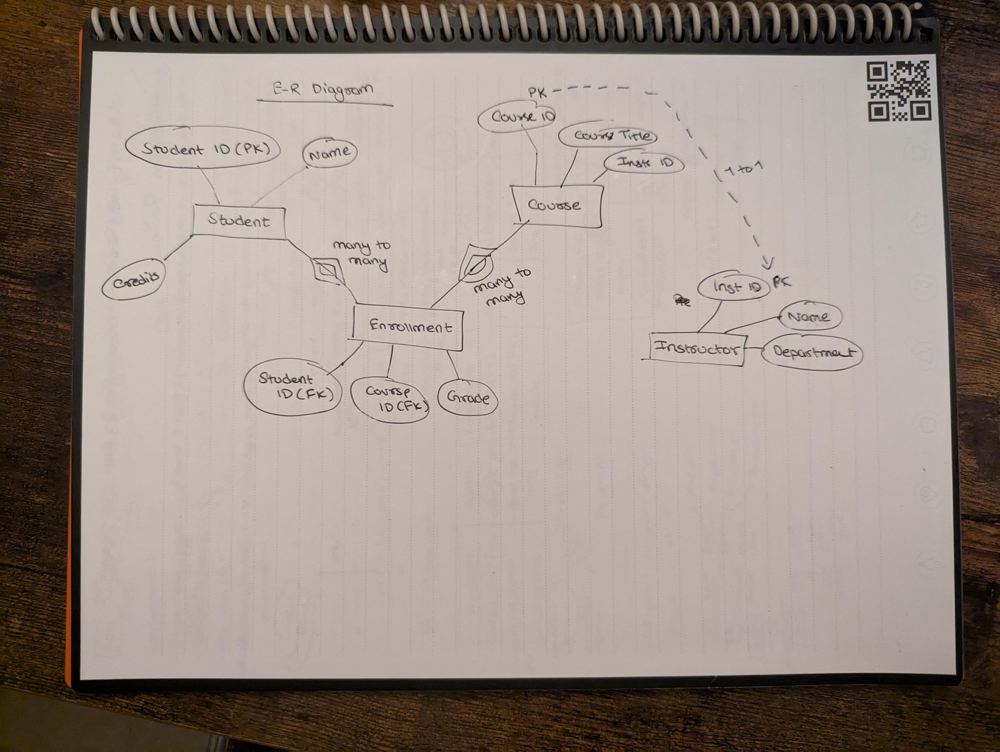
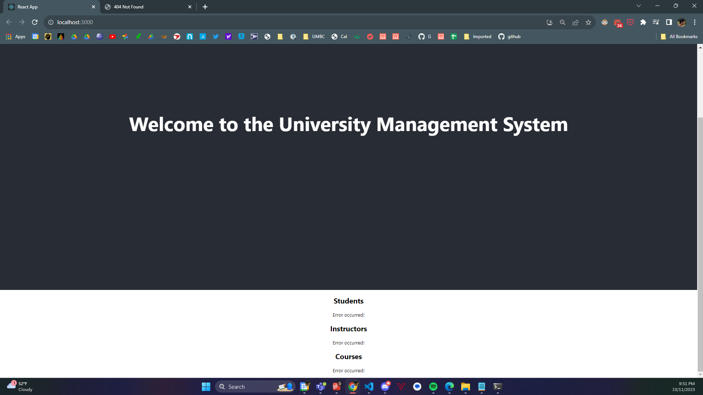
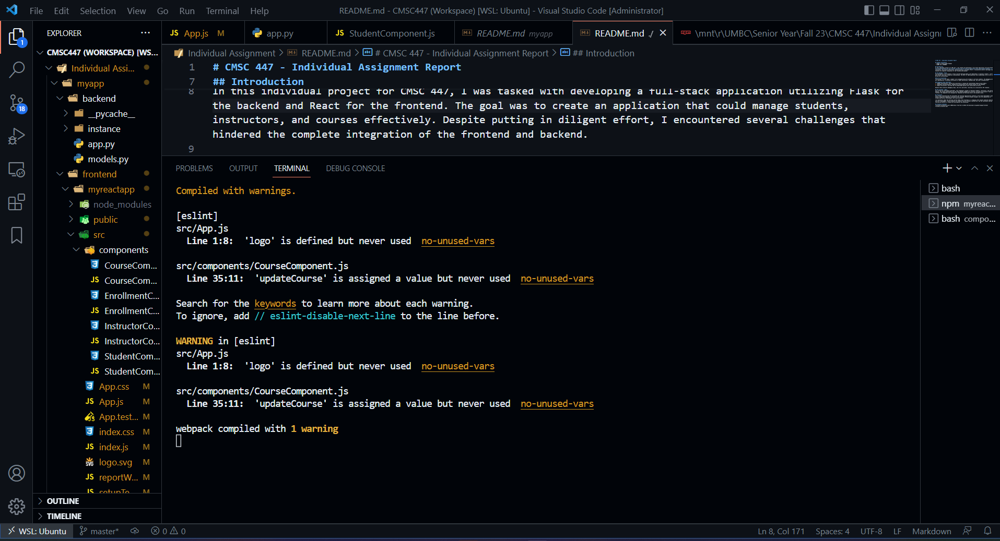

# CMSC 447 - Individual Assignment Report

## Student Information
- **Name:** Rajjya Rohan Paudyal
- **UMBC ID:** SR30095
- **Email:** rajjyap1@umbc.edu

## Introduction
In this individual project for CMSC 447, I was tasked with developing a full-stack application utilizing Flask for the backend and React for the frontend. The goal was to create an application that could manage students, instructors, and courses effectively. Despite putting in diligent effort, I encountered several challenges that hindered the complete integration of the frontend and backend.

## Database Design (E-R Diagram)

## The Backend - Flask
The development of the backend in Flask involved defining models with SQLAlchemy to represent students, instructors, and courses, and their respective relationships. The APIs for CRUD operations were established, but an error arose during the testing phase.

### Error Encountered
A persistent "no such table: student" error emerged during the attempt to retrieve students. The debugging process was comprehensive, including verification of model definitions, database URI, and other configurations.

### Debugging Steps Undertaken
1. **Model Consistency**: Ensured the consistency in naming and relationships among various models.
2. **Database Initialization**: Checked the initialization and creation process of the database.
3. **Query Structure**: Verified that the SQLAlchemy queries were constructed correctly.

Despite these extensive debugging steps, the error persisted, resulting in an unsuccessful API response.

## The Frontend - React
The frontend was developed using React, with components created to represent students, instructors, and courses. However, the issues encountered with the Flask backend impeded the successful retrieval and display of data on the frontend. The components were designed but remained non-functional due to the backend issues.

## Conclusion
This project showcased both the challenges and learning opportunities inherent in full-stack development. Each hurdle, though not completely resolved in this instance, offered valuable insights into the complexities of integrating diverse technologies like Flask and React.

I am optimistic about the learning journey ahead. Each challenge is a stepping stone towards enhanced understanding and skill development. Future projects will benefit from the lessons learned here, and the continuous journey of learning and mastery is viewed with anticipation and enthusiasm.

## Frontend Screenshot

## VSCode Workspace

